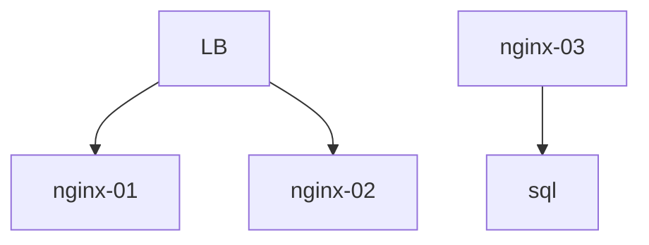

# Documentação de uso Markdown

este é um paragrafo

## este é outro header

este é outro paragrafo

### este é outro header ainda menor 

### desenho infra 


###### este então nem se fala 

* item 1 da lista 
* item 2 da lista
- este é outro item
+ outro item da lista 
+ outro item da lista 

1. item 1
..outro item

2. outro item da lista

*ola* 

**eaa**

***bear*** 

__teste__ 

~~teste~~  
## Veja o exemplo  com a linguagem 
____ 
```python
user = "root"

def login(user):
  return "ok"
````
___ 
> cuidado 
>
> não mexa aqui
> este documento é importante 


acesse aqui:
[Clique aqui ](https://sregormp.github.io)

![imagem aqui][logo]:


